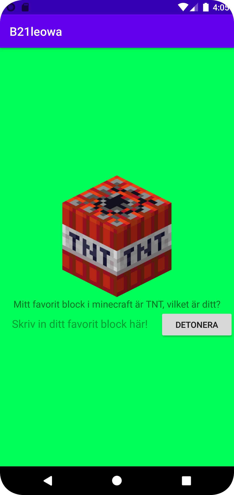

# Rapport

So started the project by removing constraint layout and added LinearLayout.
Now the layout is LinearLayout and then added an ImageView. The imageView is an image of my favorite block in minecraft.
Then I added another LinearLayout with an EditText and a button which and changed the orientation to horizontal.
That's because I wanted the EditText and button to be next to each other.
The EditText has to have wrap_content otherwise it will be to big to have the button next to it. See code snippet below.

When the button was visible I set onClick="detonate" and added logic to the MainActivity: System.exit(0);
So when the button is pressed the program will exit.

```xml
<LinearLayout
             android:layout_width="match_parent"
             android:layout_height="wrap_content"
             android:orientation="horizontal">

             <EditText
                 android:layout_width="wrap_content"
                 android:layout_height="wrap_content"
                 android:layout_marginStart="16dp"
                 android:layout_marginEnd="16dp"
                 android:hint="@string/textField"
                 />

             <Button
                 android:id="@+id/detonate"
                 android:layout_width="match_parent"
                 android:layout_height="wrap_content"
                 android:onClick="detonate"
                 android:text="@string/detonate" />
</LinearLayout>

```
This is the final product:
